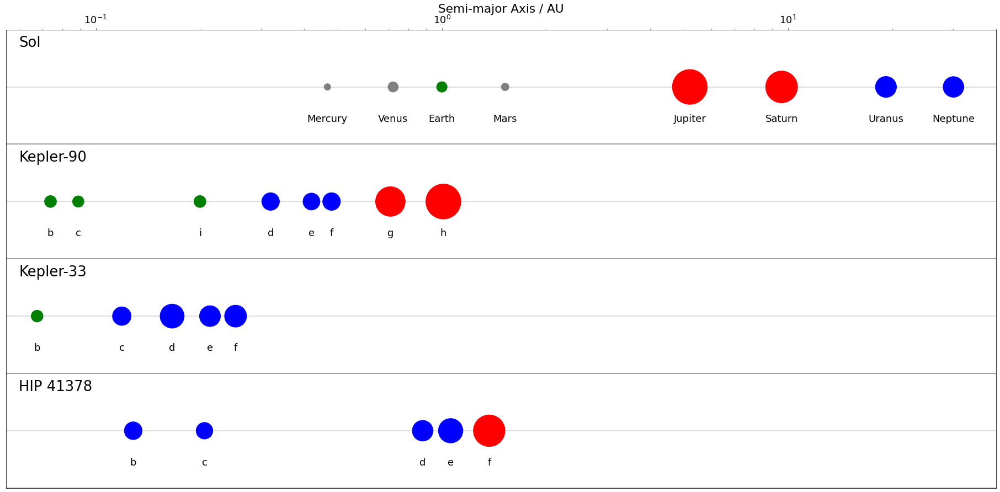

# exoplanet
This a quick bit of Python I mocked up to mirror a chart I found in Cabera, J. et al 2013, THE PLANETARY SYSTEM TO KIC 11442793: A COMPACT ANALOGUE TO THE SOLAR SYSTEM; but to draw it for other systems.

Due to time pressure and laziness I manually put the values in using a spreadsheet to convert to R_J, the base values are all in one array of System.

A System object has a name and an array of Planets.

The Planet class is initialised with:
Planet(name, axes, radius)
Where axes uses AU and radius uses Jupiter radius

---

There's legacy code where it used a picture of Mercury / Earth / Neptune / Jupiter for each class; I felt this distracted from the chart so I replaced them with colours. If you want to change this I used a set of pictures of each planet which were 122 x 122 pixels. Then uncomment lines 33, 40, 41 and 42 and comment out line 34.

---
# Example Plot

